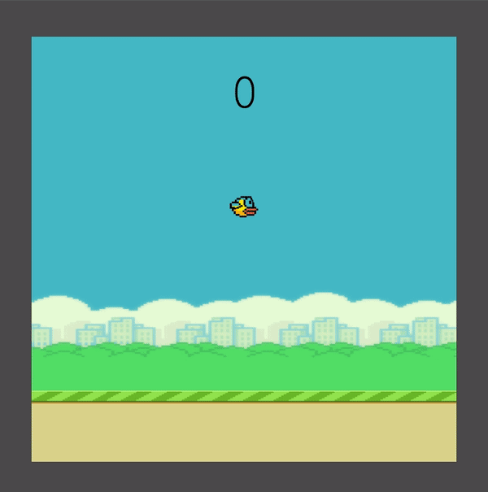

# Flappy Bird
Welcome to the Flappy Bird project! [You can access the game by clicking here.](https://semawebdev.github.io/flappy-bird) The objective is to navigate the bird through pipes using the mouse or the space button. The player scores one point each second, so the bird doesn't crash into a pipe or the ground.

## Tech Stack
The project is built using Javascript, pj5.js, HTML, and CSS. 

## Getting Started
This repository contains the source code and assets for the popular game Flappy Bird. Simply clone or download the repository to your local machine and open the project in your preferred coding editor. 

## Assets and Artwork
All assets and artwork used in the game are included in the repository. Feel free to use these assets to create your version of Flappy Bird, or use them as a starting point for a new game project.

## Contributions
If you would like to contribute to the project, simply fork the repository and create a pull request with your changes. Your contributions are greatly appreciated!

## Support
If you have any questions or issues with the game, please open an issue on the repository, and the maintainers will get back to you as soon as possible.

Thank you for using Flappy Bird! Have fun playing and creating.
